## Game Icons List

| Icon | Name | Icon | Name | Icon | Name |
| :--: | :--- | :--: | :--- | :--: | :--- |
|  | `Arrow Damage Enchantment` |  | `Arrow Speed Enchantment` | 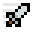 | `Attack Speed Enchantment` |
| 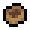 | `Boating` |  | `Break Speed Enchantment` |  | `Bunny Hop` |
|  | `Critical Damage Enchantment` |  | `Damage` |  | `Damage Enchantment` |
| 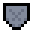 | `Damage Reduction` | 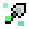 | `Digging Aura Enchantment` |  | `Double Jump` |
| 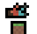 | `FallDamage` | 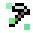 | `Farming Aura Enchantment` |  | `Farming Yield Enchantment` |
|  | `Feather Falling` |  | `Fist` |  | `Frozen` |
| 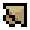 | `Gliding` | 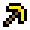 | `Haste` |  | `Health` |
|  | `HealthShield` |  | `Health Enchantment` |  | `Health Regen` |
|  | `Health Regen Enchantment` |  | `Heat Resistance` | 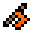 | `Horizontal Knockback Enchantment` |
|  | `Hydrated` |  | `Invisible` |  | `Jump Boost` |
| 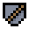 | `Knockback Resist Enchantment` | 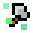 | `Lumber Aura Enchantment` | 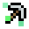 | `Mining Aura Enchantment` |
|  | `Mining Yield Enchantment` | 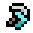 | `Momentum Enchantment` | 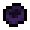 | `Obsidian Boating` |
|  | `Poisoned` | 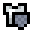 | `Protection Enchantment` |  | `Quick Charge Enchantment` |
|  | `Rested Aura` |  | `Rested Damage` |  | `Rested Farming Yield` |
| 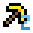 | `Rested Haste` | 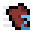 | `Rested Speed` |  | `Riding` |
|  | `Slowness` | 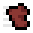 | `Speed` | 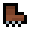 | `Stomp Damage Enchantment` |
| 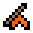 | `Vertical Knockback Enchantment` |  | `VoidJump` |  | `Weakness` |