# Bloxd Icon Reference Table

This file lists all the available icons in the game. 

| Icon | Name | Icon | Name | Icon | Name |
| :--: | :--- | :--: | :--- | :--: | :--- |
|  | `angle-down` | 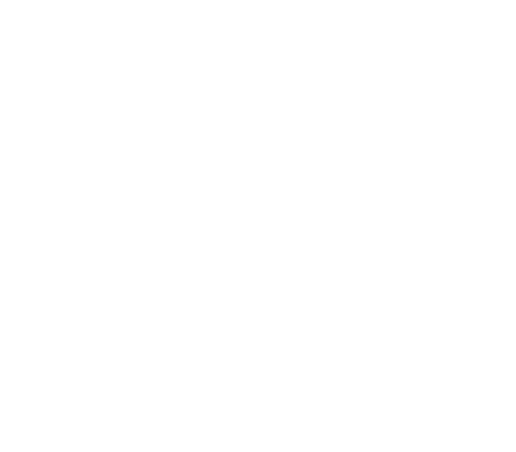 | `angle-up` |  | `angles-up` |
| 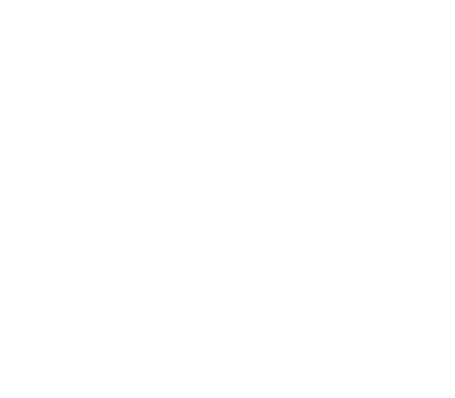 | `arrow-up-right-from-square` |  | `arrow-up` | 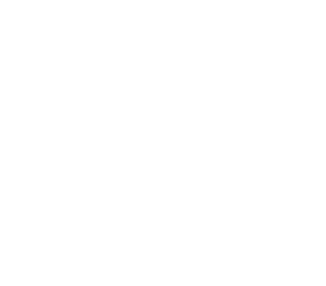 | `arrows-rotate` |
|  | `award` | 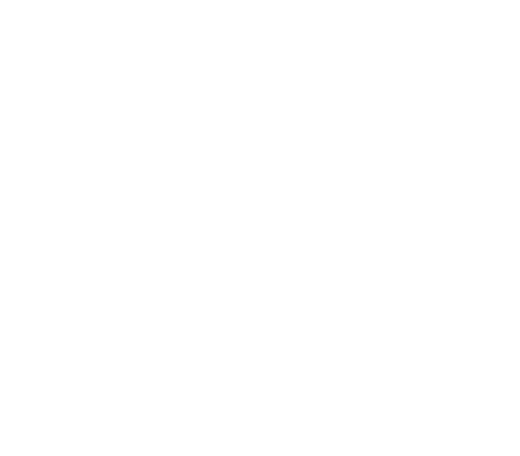 | `backpack` |  | `bars` |
| 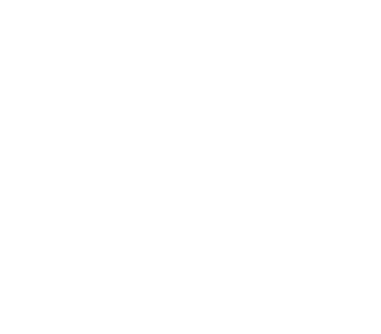 | `block-question` |  | `bolt` |  | `caret-up` |
|  | `cart-shopping` |  | `check` | 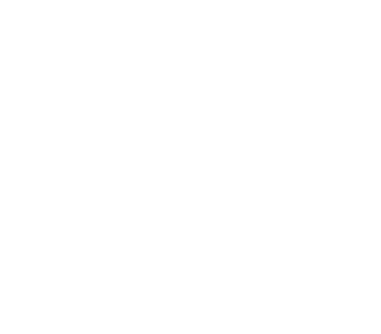 | `chess-rook` |
|  | `circle-info` | 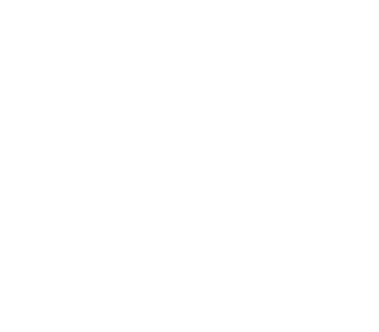 | `clock-rotate-left` |  | `coins` |
|  | `comment-dots` | 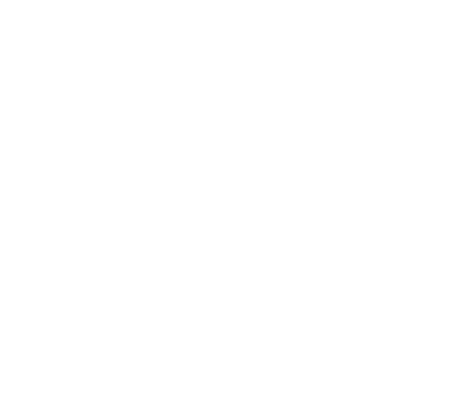 | `compress` |  | `cookie` |
| 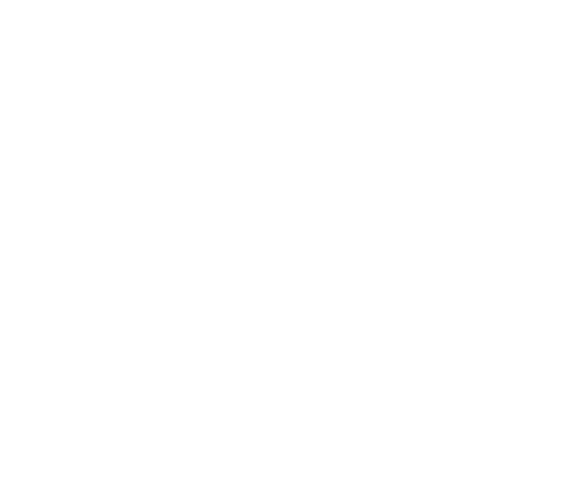 | `copy` |  | `crosshairs` |  | `crown` |
| 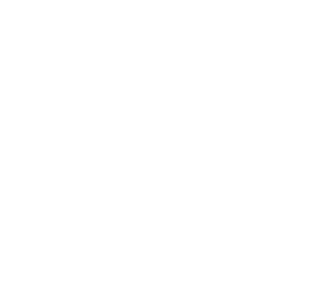 | `cube` |  | `cubes` |  | `dice` |
| 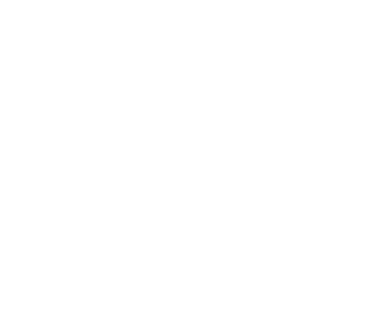 | `door-closed` |  | `door-open` | 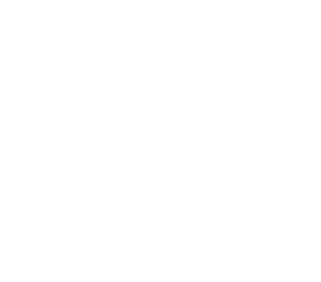 | `download` |
|  | `ellipsis` |  | `exclamation` |  | `expand` |
|  | `eye-slash` |  | `eye` |  | `face-dizzy` |
|  | `feather-pointed` |  | `file-lines` |  | `film` |
|  | `fire` |  | `flag` |  | `folder-image` |
|  | `gauge-high` |  | `gear` |  | `gem` |
|  | `globe` |  | `hammer` | 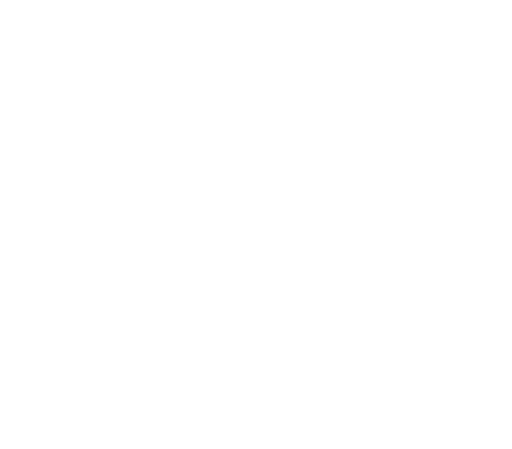 | `hand-fist` |
|  | `hand-holding-medical` |  | `hand-point-left` |  | `heart` |
| 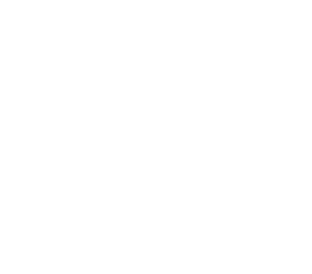 | `icons` |  | `joystick` |  | `lightbulb` |
| 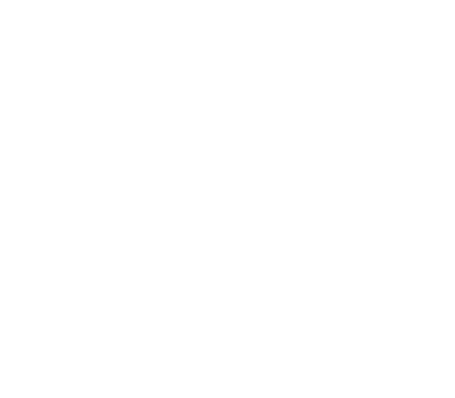 | `list` |  | `location-check` | 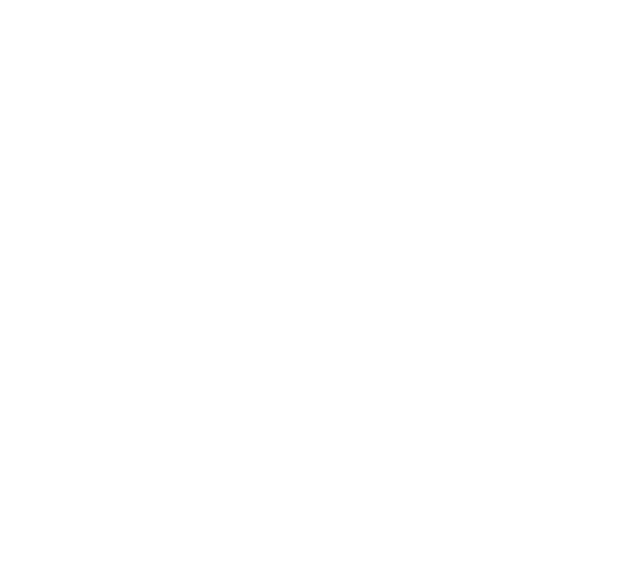 | `location-xmark` |
|  | `lock-open` |  | `lock` |  | `magnifying-glass` |
|  | `music` | 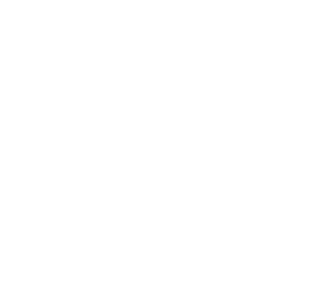 | `palette` |  | `paste` |
|  | `pen-field` | 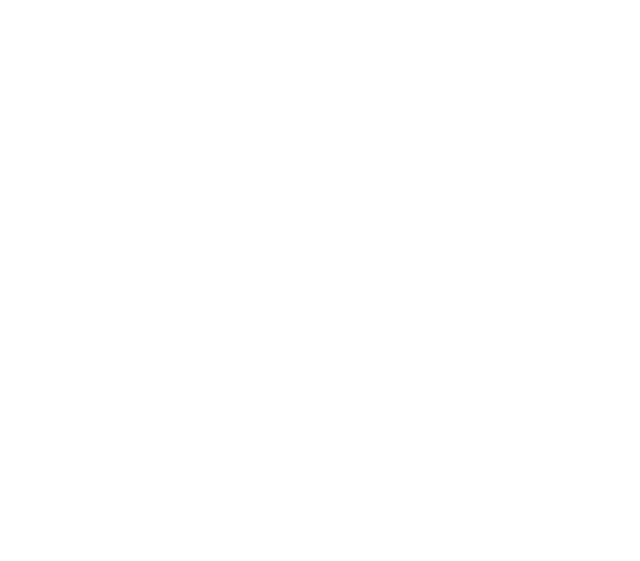 | `pen` |  | `person-arrow-down-to-line` |
|  | `person-arrow-up-from-line` |  | `person-falling-burst` | 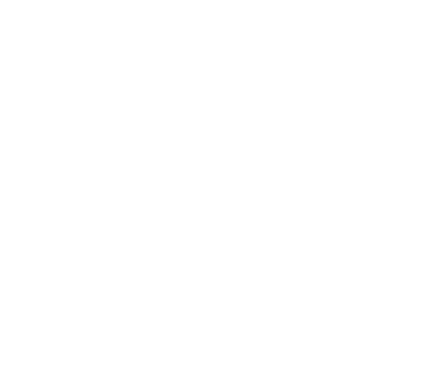 | `person-military-pointing` |
|  | `plus` |  | `power-off` |  | `right-from-bracket` |
|  | `rocket-launch` | 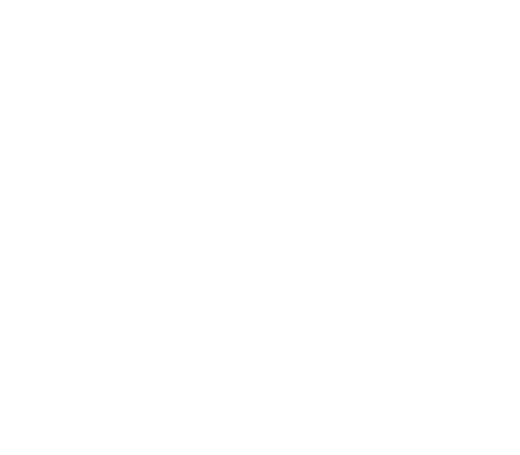 | `rotate-right` |  | `shield-halved` |
| 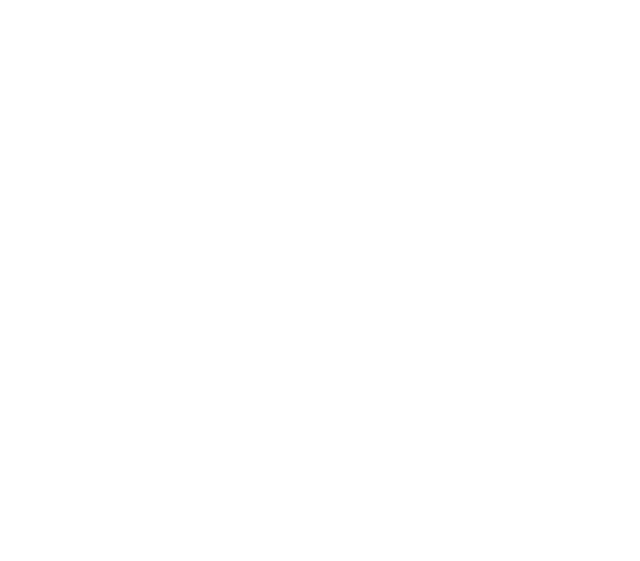 | `shield` |  | `shirt` |  | `snowflake` |
| 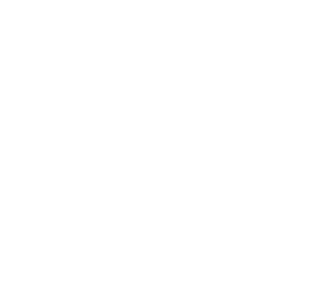 | `square-minus` |  | `star` |  | `terminal` |
|  | `trophy` |  | `up-from-bracket` |  | `upload` |
| 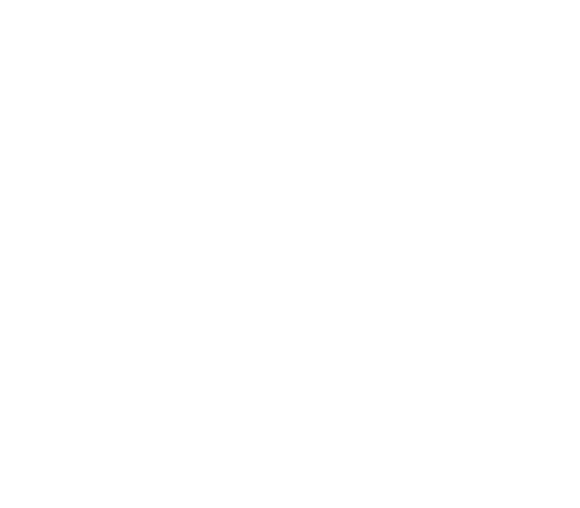 | `user-group-crown` |  | `user-group` |  | `user-plus` |
| 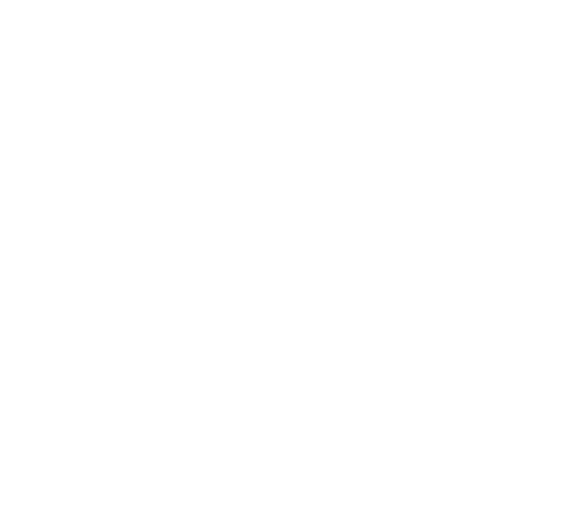 | `user-slash` |  | `user-unlock` |  | `user` |
| 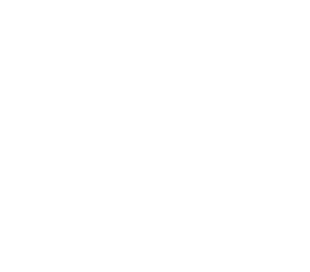 | `video` |  | `volume-low` |  | `wrench` |
|  | `x` |  | `youtube` | | |


| Icon | Name | Icon | Name | Icon | Name |
| :--: | :--- | :--: | :--- | :--: | :--- |
|  | `angle-down` |  | `angle-up` |  | `angles-up` |
|  | `arrow-up-right-from-square` |  | `arrow-up` |  | `arrows-rotate` |
|  | `award` |  | `backpack` |  | `bars` |
|  | `block-question` |  | `bolt` |  | `caret-up` |
|  | `cart-shopping` |  | `check` |  | `chess-rook` |
|  | `circle-info` |  | `clock-rotate-left` |  | `coins` |
|  | `comment-dots` |  | `compress` |  | `cookie` |
|  | `copy` |  | `crosshairs` |  | `crown` |
|  | `cube` |  | `cubes` |  | `dice` |
|  | `door-closed` |  | `door-open` |  | `download` |
|  | `ellipsis` |  | `exclamation` |  | `expand` |
|  | `eye-slash` |  | `eye` |  | `face-dizzy` |
|  | `feather-pointed` |  | `file-lines` |  | `film` |
|  | `fire` |  | `flag` |  | `folder-image` |
|  | `gauge-high` |  | `gear` |  | `gem` |
|  | `globe` |  | `hammer` |  | `hand-fist` |
|  | `hand-holding-medical` |  | `hand-point-left` |  | `heart` |
|  | `icons` |  | `joystick` |  | `lightbulb` |
|  | `list` |  | `location-check` |  | `location-xmark` |
|  | `lock-open` |  | `lock` |  | `magnifying-glass` |
|  | `music` |  | `palette` |  | `paste` |
|  | `pen-field` |  | `pen` |  | `person-arrow-down-to-line` |
|  | `person-arrow-up-from-line` |  | `person-falling-burst` |  | `person-military-pointing` |
|  | `plus` |  | `power-off` |  | `right-from-bracket` |
|  | `rocket-launch` |  | `rotate-right` |  | `shield-halved` |
|  | `shield` |  | `shirt` |  | `snowflake` |
|  | `square-minus` |  | `star` |  | `terminal` |
|  | `trophy` |  | `up-from-bracket` |  | `upload` |
|  | `user-group-crown` |  | `user-group` |  | `user-plus` |
|  | `user-slash` |  | `user-unlock` |  | `user` |
|  | `video` |  | `volume-low` |  | `wrench` |
|  | `x` |  | `youtube` | | |
```